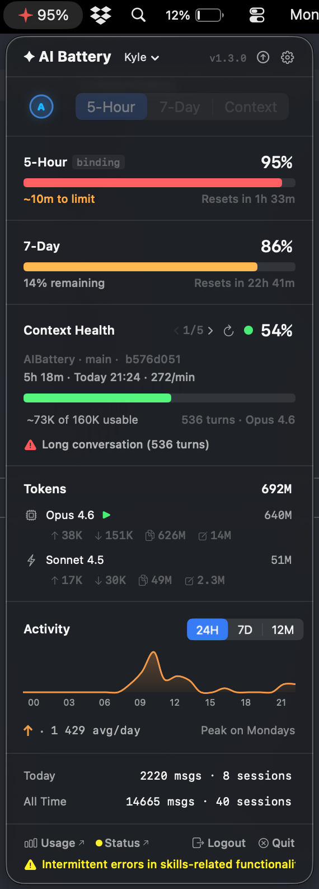
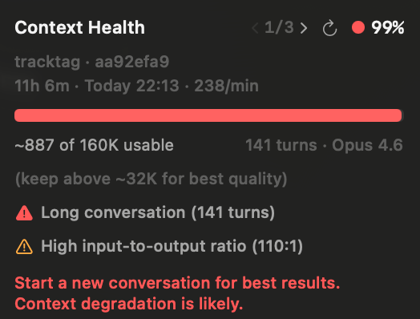
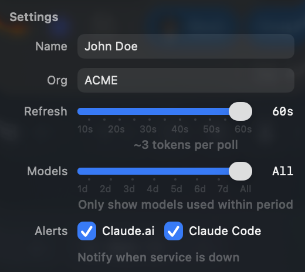

<div align="center">

# ✦ AI Battery

**A battery meter for Claude Code.**

Rate limits, context health, and token usage — always visible in your macOS menu bar.

[](https://swift.org)
[](https://www.apple.com/macos/)
[](LICENSE)
[](https://github.com/KyleNesium/AIBattery/actions/workflows/ci.yml)
[](https://github.com/KyleNesium/AIBattery/stargazers)
[](https://github.com/KyleNesium/AIBattery/releases)

<br/>



<br/>


</div>

---

## Install

**Homebrew** (recommended):

```bash
brew tap KyleNesium/tap
brew install --cask aibattery
```

**Quick install** — paste in Terminal:

```bash
curl -sL https://github.com/KyleNesium/AIBattery/releases/latest/download/AIBattery.zip -o /tmp/AIBattery.zip && ditto -x -k /tmp/AIBattery.zip /Applications && xattr -cr /Applications/AIBattery.app && open /Applications/AIBattery.app
```

**Or download the DMG** from [Releases](https://github.com/KyleNesium/AIBattery/releases/latest):

1. Open `AIBattery.dmg` and drag **AI Battery** to **Applications**
2. Launch from Applications — macOS will block it on first run
3. Open **System Settings → Privacy & Security** → scroll down → click **Open Anyway**

> **Terminal alternative:** If macOS says the app is damaged, run `xattr -cr /Applications/AIBattery.app` then relaunch.

**Or build from source:**

```bash
git clone https://github.com/KyleNesium/AIBattery.git && cd AIBattery
./scripts/build-app.sh
open .build/AIBattery.app
```

Requires **macOS 13+** and [Claude Code](https://docs.anthropic.com/en/docs/claude-code).

## Update

**Homebrew:**

```bash
brew upgrade --cask aibattery
```

**Or** re-run the quick install command — it overwrites the old version in place:

```bash
curl -sL https://github.com/KyleNesium/AIBattery/releases/latest/download/AIBattery.zip -o /tmp/AIBattery.zip && ditto -x -k /tmp/AIBattery.zip /Applications && xattr -cr /Applications/AIBattery.app && open /Applications/AIBattery.app
```

Or download the latest DMG from [Releases](https://github.com/KyleNesium/AIBattery/releases/latest), open it, and drag **AI Battery** to **Applications** — replace the existing copy when prompted.

Your settings and OAuth session carry over automatically.

## Authentication

OAuth 2.0 with PKCE — same protocol as Claude Code. Supports up to **2 accounts** (separate Claude orgs).

1. Launch AI Battery — the auth screen appears on first run
2. Click **Authenticate** → browser opens to Anthropic's sign-in page
3. Sign in → copy the authorization code
4. Paste into AI Battery → done

To add a second account, click the account name in the header → **Add Account**, or open Settings (⚙️) → **Add Account**.

Switch between accounts by clicking the account name dropdown in the header. Each account has its own rate limits, tokens, and identity.

Sessions auto-refresh (with a 5-minute buffer to avoid clock-skew issues). Temporary server errors retry automatically. Tokens stored in macOS Keychain per account (separate from Claude Code credentials). Error messages are specific — expired codes, invalid codes, server errors, and network errors each get a clear description.

### Why does macOS block the app or ask about Keychain access?

AI Battery isn't notarized — there's no Apple Developer license behind this project, so macOS treats it as unidentified. Two prompts may appear on first launch:

- **Gatekeeper block** — macOS prevents the app from opening. Fix: **System Settings → Privacy & Security → Open Anyway** (see [Install](#install))
- **Keychain access** — the app stores OAuth tokens in macOS Keychain (one set per account), Apple's encrypted credential store. This is the safest option — the same place Claude Code, browsers, and every other macOS app stores secrets. Click **Always Allow**.

Both are one-time prompts. Neither will appear again after the first launch.

## How It Works

AI Battery makes a minimal API call each refresh cycle to read your rate limit headers. It also reads local JSONL session logs for token counts and context health — **never your message content**.

```
✦ 71% · ACME          ← menu bar: selected metric + org
```

Click the ✦ icon to open the dashboard:

| Section | What you see |
|---|---|
| **Rate Limits** | 5-hour burst + 7-day sustained — utilization %, reset countdown, binding indicator, predictive time-to-limit |
| **Context Health** | 5 most recent sessions with `< 1/5 >` chevron + swipe navigation |
| **Tokens** | Per-model breakdown with input/output/cache read/cache write · optional API cost |
| **Insights** | Today's stats with trend arrow + projection, all-time stats with busiest day |
| **Activity** | Sparkline chart — 24H · 7D · 12M toggle |

## Metrics

The segmented toggle picks which metric drives the ✦ icon color:

| Mode | Tracks | Best for |
|---|---|---|
| **5-Hour** | Burst rate limit | Knowing when you'll get throttled |
| **7-Day** | Sustained rate limit | Pacing usage across the week |
| **Context** | Session context fullness | Knowing when to start fresh |

Selected metric moves to the top. The other two stay visible below.

## Context Health

<table>
<tr>
<td width="55%">

Shows your **5 most recent sessions** with context health. Browse with `< 1/5 >` chevrons or swipe left/right. Stale sessions (idle > 30 min) show an amber "Idle" badge.

Each session displays: **project name** · **git branch** · **duration** · **last active time**.

Percentages are relative to the **usable window** — 80% of the model's raw context window. At 100%, Claude Code auto-compacts.

| Color | Range | Meaning |
|---|---|---|
| 🟢 Green | < 60% | Plenty of room |
| 🟠 Orange | 60–80% | Quality may degrade |
| 🔴 Red | > 80% | Start a fresh session |

Additional warnings appear when context is being used inefficiently:

**⚠️ Long conversation (15+ turns)** — Nothing is discarded between turns. Your messages, Claude's responses, tool calls, and results all accumulate. After ~15 turns the window is full of old history that Claude still reads every turn — slowing responses, reducing quality, and burning through your token budget on stale context.

**⚠️ High input:output ratio (20:1+)** — More tokens are going in (file reads, error logs, tool results) than coming out. For example, reading 5 large files dumps thousands of tokens into context that Claude may only reference once. That data stays in the window for the rest of the session, consuming tokens on every subsequent turn and leaving less room for useful work.

Fix: run `/compact` to drop old history, or start a fresh session.

</td>
<td width="45%" align="center">

</td>
</tr>
</table>

**When you hit orange or red:**
1. Run `/compact` to save a summary to project memory
2. Keep key decisions in `CLAUDE.md` — loaded automatically every session
3. Start a new terminal in the same directory and pick up where you left off

## Settings

<table>
<tr>
<td width="55%">

Click ⚙️ in the header to configure:

| Setting | What it does |
|---|---|
| **Account names** | Per-account display name shown in the header and account picker |
| **Add Account** | Connect a second Claude account (up to 2) |
| **Refresh** | Poll interval: 10–60s · ~3 tokens per refresh |
| **Models** | Only show models used within period: 1–7 days or All |
| **Display → API Cost** | Show what your token usage would cost at Anthropic's published API rates |
| **Display → Decimal** | Show one decimal place in the menu bar (e.g. `42.5%` instead of `42%`) |
| **Display → Compact** | Collapse non-selected rate limit windows into a single-line summary |
| **Display → Colorblind** | Switch to a blue/cyan/amber/purple palette (deuteranopia/protanopia safe) |
| **Alerts** | Notify when Claude.ai or Claude Code goes down (separate toggles) |
| **Alerts → Rate Limit** | Notify when rate limit usage crosses a threshold (50–95%, default 80%) |
| **Startup** | Launch AI Battery automatically at login |
| **Export / Import** | Copy settings to clipboard as JSON, or import from clipboard |

The footer shows a **staleness indicator** — "Updated just now" when fresh, or "Updated Xm ago" in orange when using cached data. An **update banner** appears when a new version is available on GitHub — click **View** to open the release or **Skip** to dismiss.

**Tip:** Click any stat value (percentages, token counts, costs) to copy it to the clipboard.

</td>
<td width="45%" align="center">

</td>
</tr>
</table>

## API Cost

Enable in **Settings → Display → API Cost** to see dollar amounts in the Tokens section.

This shows what your token usage **would cost at Anthropic's published API per-token rates** — it's not your actual bill. Pro, Max, and Teams subscribers pay a flat monthly fee, not per-token. The estimate is useful for understanding the value of your usage and comparing the economics of subscription vs. API billing.

Pricing uses Anthropic's published rates for input, output, cache read, and cache write tokens per model. Total and per-model costs appear inline.

## FAQ

**Only rate limits show — tokens, models, and activity are all empty?**

Token usage, context health, and activity stats come from Claude Code's local session logs (`~/.claude/`). These populate after you've used Claude Code for a bit. To kickstart it:

1. Run a few Claude Code sessions from the terminal
2. Run `/stats` inside Claude Code — this generates the stats cache
3. AI Battery refreshes automatically every polling cycle

Rate limits (5-hour / 7-day) always work immediately since they come from the API.

**Green ✦ at 0%?** Credits just reset, or no usage yet — this is normal.

**Wrong org?** Org names come from the API automatically. Click the account name to see which account is active.

**What's "binding"?** Whichever rate limit window is currently the active constraint.

**What's ⚠️ "throttled"?** Anthropic is actively limiting your requests. Wait for the reset timer.

## Privacy

- Reads local JSONL for token counts only — **never your message content**
- Network calls: `api.anthropic.com` (rate limits) · `console.anthropic.com` (OAuth) · `status.claude.com` (status) · `api.github.com` (update check, once/24h)
- Status checks use exponential backoff on failures (60s → 5 min cap) — no hammering downed services
- Polling adapts automatically: interval doubles after 3 idle cycles, resets when data changes
- No analytics. No telemetry. No tracking.

## Architecture

```
AIBattery/
  Models/       — Data structs (UsageSnapshot, RateLimitUsage, TokenHealthStatus, ...)
  Services/     — OAuthManager, RateLimitFetcher, SessionLogReader, TokenHealthMonitor, ...
  ViewModels/   — Single UsageViewModel (@MainActor, ObservableObject)
  Views/        — SwiftUI views (popover sections, menu bar label, auth screen)
  Utilities/    — TokenFormatter, ModelNameMapper, ThemeColors, SettingsManager, AppLogger, UserDefaultsKeys
```

Zero dependencies — Apple frameworks only (SwiftUI, Charts, Security, Foundation, AppKit).

Detailed specs in [`spec/`](spec/):

| File | Covers |
|---|---|
| [`ARCHITECTURE.md`](spec/ARCHITECTURE.md) | Data flow, project tree, build config, network & file access |
| [`DATA_LAYER.md`](spec/DATA_LAYER.md) | Every model, service, and algorithm |
| [`UI_SPEC.md`](spec/UI_SPEC.md) | View hierarchy, layout rules, section specs |
| [`CONSTANTS.md`](spec/CONSTANTS.md) | Every hardcoded value — thresholds, URLs, pricing, sizes |

## Uninstall

**Homebrew:**

```bash
brew uninstall --cask aibattery
```

**Manual:**

1. Right-click **AI Battery** in the menu bar → **Quit**
2. Open **Applications** in Finder → drag **AI Battery** to the Trash

To also remove stored settings, run in Terminal:

```bash
security delete-generic-password -s "AIBattery" 2>/dev/null   # OAuth tokens (all accounts)
defaults delete com.KyleNesium.AIBattery 2>/dev/null           # Preferences
```

AI Battery doesn't write any other files. Your Claude Code data (`~/.claude/`) is untouched.

## Accessibility

All interactive UI elements include VoiceOver labels. The app is navigable with keyboard and screen readers. A **colorblind mode** (Settings → Display → Colorblind) switches to a blue/cyan/amber/purple palette for users with color vision deficiency. A **first-launch tutorial** walks through the key sections on first use.

## Contributing

Contributions welcome! Please read the [contributing guide](CONTRIBUTING.md) first. See [CHANGELOG.md](CHANGELOG.md) for version history.

## License

[MIT](LICENSE)
