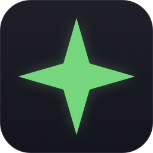
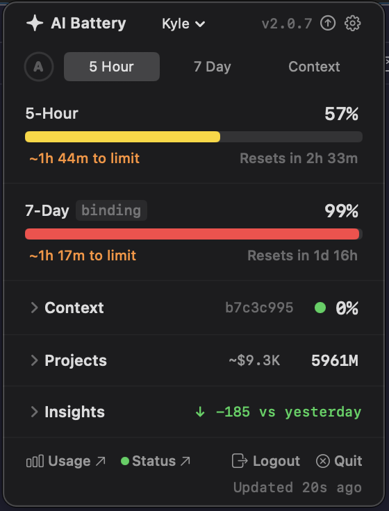
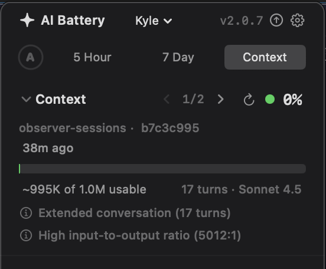
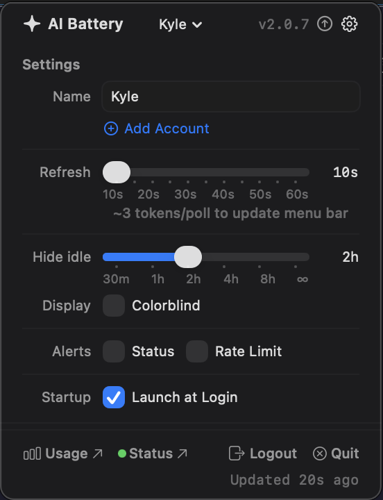

<div align="center">



# AI Battery

**Get the most out of your Claude subscription.**

Monitor rate limits, context health, and token usage — always visible in your macOS menu bar. Know exactly when to pace yourself, when to start a fresh session, and how much runway you have left.

[](https://swift.org)
[](https://www.apple.com/macos/)
[](LICENSE)
[](https://github.com/KyleNesium/AIBattery/actions/workflows/ci.yml)
[](https://github.com/KyleNesium/AIBattery/stargazers)
[](https://github.com/KyleNesium/AIBattery/releases)

<br/>




</div>

---

<details>
<summary><strong>Table of Contents</strong></summary>

- [Install](#-install)
- [Update](#-update)
- [Authentication](#-authentication)
- [How It Works](#-how-it-works)
- [Metrics](#-metrics)
- [Context Health](#-context-health)
- [Settings](#%EF%B8%8F-settings)
- [API Cost](#-api-cost)
- [Troubleshooting](#-troubleshooting)
- [FAQ](#-faq)
- [Privacy](#-privacy)
- [Architecture](#-architecture)
- [Accessibility](#-accessibility)
- [Uninstall](#-uninstall)
- [Contributing](#-contributing)
- [Support](#-support)
- [License](#-license)

</details>

---

## 📦 Install

<table>
<tr>
<td width="30"></td>
<td><strong>Homebrew</strong> (recommended)</td>
</tr>
</table>

```bash
brew tap KyleNesium/tap
brew install --cask aibattery
```

<details>
<summary>⚡ <strong>Quick install</strong> — paste in Terminal</summary>

```bash
curl -sL https://github.com/KyleNesium/AIBattery/releases/latest/download/AIBattery.zip -o /tmp/AIBattery.zip && ditto -x -k /tmp/AIBattery.zip /Applications && xattr -cr /Applications/AIBattery.app && open /Applications/AIBattery.app
```

</details>

<details>
<summary>💿 <strong>DMG download</strong></summary>

Download from [Releases](https://github.com/KyleNesium/AIBattery/releases/latest):

1. Open `AIBattery.dmg` and drag **AI Battery** to **Applications**
2. Launch from Applications — macOS will block it on first run
3. Open **System Settings → Privacy & Security** → scroll down → click **Open Anyway**

> [!TIP]
> If macOS says the app is damaged, run `xattr -cr /Applications/AIBattery.app` then relaunch.

</details>

<details>
<summary>🛠 <strong>Build from source</strong></summary>

```bash
git clone https://github.com/KyleNesium/AIBattery.git && cd AIBattery
./scripts/build-app.sh
open .build/AIBattery.app
```

</details>

Requires **macOS 13+** and [Claude Code](https://docs.anthropic.com/en/docs/claude-code).

---

## 🔄 Update

AI Battery checks for new versions once per day. When an update is available, the arrow button in the header turns **yellow** and a banner appears.

**In-app (recommended):** Click **Install Update** in the banner. [Sparkle](https://sparkle-project.org/) downloads the update, verifies its EdDSA signature, replaces the app, and relaunches — all without leaving the app.

**Homebrew:**

```bash
brew upgrade --cask aibattery
```

**DMG:** Download the latest DMG from [Releases](https://github.com/KyleNesium/AIBattery/releases/latest), open it, and drag to Applications — replace when prompted.

**Or** re-run the quick install command — it overwrites the old version in place.

> [!NOTE]
> Your settings and OAuth session carry over automatically. Updates are user-initiated only — the app never downloads or installs anything in the background.

---

## 🔐 Authentication

OAuth 2.0 with PKCE — same protocol as Claude Code. Supports up to **2 accounts** (separate Claude orgs).

| Step | Action |
|:---:|---|
| **1** | Launch AI Battery — the auth screen appears on first run |
| **2** | Click **Sign In** → browser opens to Anthropic's sign-in |
| **3** | Sign in → copy the authorization code |
| **4** | Paste into AI Battery → done |

To add a second account: click the account dropdown in the header → **Add Account**, or open Settings → **Add Account**.

Switch between accounts by clicking the account dropdown in the header. Each account has its own rate limits, tokens, and identity.

<details>
<summary>🔑 <strong>Session details</strong></summary>

- Sessions auto-refresh with a 5-minute buffer to avoid clock-skew issues
- Temporary server errors retry automatically
- Refresh token stored in macOS Keychain per account (separate from Claude Code credentials); access token held in memory only
- Error messages are specific — expired codes, invalid codes, server errors, and network errors each get a clear description

</details>

<details>
<summary>🛡 <strong>Why does macOS block the app or ask about Keychain access?</strong></summary>

AI Battery isn't notarized — there's no Apple Developer license behind this project, so macOS treats it as unidentified. Two prompts may appear on first launch:

- **Gatekeeper block** — macOS prevents the app from opening. Fix: **System Settings → Privacy & Security → Open Anyway** (see [Install](#-install))
- **Keychain access** — the app stores its OAuth refresh token in macOS Keychain (one item per account), Apple's encrypted credential store. Click **Always Allow**. The prompt may reappear once after an in-app update because the new binary has a different ad-hoc signature.

The Gatekeeper prompt is one-time. The Keychain prompt appears once on first launch and once after each in-app update.

</details>

---

## 🔋 How It Works

AI Battery makes a minimal API call each refresh cycle to read your rate limit headers. It also reads local JSONL session logs for token counts and context health — **never your message content**.

```
✦ 71%                 ← menu bar: selected metric
```

Click the ✦ icon to open the dashboard:

| Section | What you see |
|---|---|
| 📊 **Rate Limits** | 5-hour burst + 7-day sustained — utilization %, reset countdown, binding indicator, predictive time-to-limit |
| 🧠 **Context Health** | 5 most recent sessions with `< 1/5 >` chevron + swipe navigation |
| 🔤 **Tokens** | Per-model breakdown with input/output/cache read/cache write · optional API cost |
| 📈 **Insights** | Today's stats with trend arrow + projection, all-time stats with busiest day |
| 📉 **Activity** | Sparkline chart — 24H · 7D · 12M toggle |

---

## 📐 Metrics

The segmented toggle picks which metric drives the ✦ icon color:

| Mode | Tracks | Best for |
|---|---|---|
| ⏱ **5-Hour** | Burst rate limit | Knowing when you'll get throttled |
| 📅 **7-Day** | Sustained rate limit | Pacing usage across the week |
| 🧠 **Context** | Session context fullness | Knowing when to start fresh |
| **(A) Auto** | Highest of the three | Always seeing the most critical metric |

Selected metric moves to the top. The other two stay visible below.

**Auto mode**: click the **(A)** button next to the toggle. It glows blue when active and automatically selects whichever metric has the highest percentage — so the menu bar always shows your most critical limit.

---

## 🧠 Context Health

<table>
<tr>
<td width="55%">

Shows your **5 most recent sessions** with context health. Browse with `< 1/5 >` chevrons or swipe left/right. Stale sessions (idle > 30 min) show an amber "Idle" badge.

Each session displays: **project name** · **git branch** · **duration** · **last active time**.

Percentages are relative to the **usable window** — 80% of the model's raw context window. At 100%, Claude Code auto-compacts.

**Think of context as Claude's short-term memory.** Every message, file read, tool call, and response accumulates in a 200K-token window. Nothing is discarded between turns. When the window fills up (100% of usable), Claude Code auto-compacts — it summarizes the session into a few paragraphs and clears the rest. That summary is lossy: file contents, specific instructions, and nuanced decisions get compressed. Claude keeps working, but from a recap instead of the real conversation. Quality degrades even before that point — a packed window means Claude is scanning thousands of stale tokens every turn, making responses slower and less accurate. Keep at least 20–40% free for best results.

| Color | Range | Meaning |
|---|---|---|
| 🟢 Green | < 60% | Plenty of room |
| 🟠 Orange | 60–80% | Quality may degrade |
| 🔴 Red | > 80% | Start a fresh session |

</td>
<td width="45%" align="center">

</td>
</tr>
</table>

<details>
<summary>⚠️ <strong>Understanding context warnings</strong></summary>

**Long conversation (15+ turns)** — Nothing is discarded between turns. Your messages, Claude's responses, tool calls, and results all accumulate. After ~15 turns the window is full of old history that Claude still reads every turn — slowing responses, reducing quality, and burning through your token budget on stale context.

**High input:output ratio (20:1+)** — More tokens are going in (file reads, error logs, tool results) than coming out. For example, reading 5 large files dumps thousands of tokens into context that Claude may only reference once. That data stays in the window for the rest of the session, consuming tokens on every subsequent turn and leaving less room for useful work.

**Zero-output session** — Session has multiple turns but no output tokens. May indicate an error loop or stalled conversation.

**Rapid token consumption** — Very short session with high token usage. Large files or long pastes may be filling the context window quickly.

</details>

> [!TIP]
> **When you hit orange or red:**
> 1. Run `/compact` to save a summary to project memory
> 2. Keep key decisions in `CLAUDE.md` — loaded automatically every session
> 3. Start a new terminal in the same directory and pick up where you left off

---

## ⚙️ Settings

<table>
<tr>
<td width="55%">

Click ⚙️ in the header to configure:

| Setting | What it does |
|---|---|
| ➕ **Add Account** | Connect a second Claude account (up to 2) |
| ✏️ **Account names** | Custom label per account (shown in picker + menu bar) |
| 🔁 **Auto mode** | Always show the highest metric (pulsing blue button on metric toggle) |
| 🔄 **Refresh** | Poll interval: 10–60s · ~3 tokens per refresh |
| ⏳ **Idle** | Hide sessions idle longer than cutoff from context health: 30m–8h or Never |
| 🎨 **Colorblind** | Blue/cyan/amber/purple palette |
| 💲 **Cost*** | Show equivalent API token rates |
| 🔔 **Alerts** | Notify on status page outages (all components) |
| ⚡ **Rate Limit** | Notify when usage crosses threshold (50–95%) |
| 🚀 **Launch at Login** | Start automatically when you log in |

</td>
<td width="45%" align="center">

</td>
</tr>
</table>

The header shows an **update indicator** when a new version is available — the arrow button turns yellow, and a banner appears with the version number and an **Install Update** button. Clicking Install Update downloads, verifies, and installs the update in-app via Sparkle. Click the ✕ to dismiss the banner; the yellow button re-shows it.

> [!TIP]
> Click any stat value (percentages, token counts, costs) to copy it to the clipboard.

---

## 💰 API Cost

Enable in **Settings → Display → Cost*** to see dollar amounts in the Tokens section.

This shows what your token usage **would cost at Anthropic's published API per-token rates** — it's not your actual bill. Pro, Max, and Teams subscribers pay a flat monthly fee, not per-token. The estimate is useful for understanding the value of your usage and comparing the economics of subscription vs. API billing.

Pricing uses Anthropic's published rates for input, output, cache read, and cache write tokens per model.

---

## 🔧 Troubleshooting

<details open>
<summary><strong>App appears in the menu bar then disappears</strong></summary>

**On first launch:** macOS Gatekeeper may silently kill the app because it's not notarized.

```bash
xattr -cr /Applications/AIBattery.app
```

Then relaunch. This removes the quarantine flag that macOS adds to downloaded apps.

**After working for a while:** If the icon vanishes after the app has been running, update to the latest version — v1.2.3+ fixed concurrency issues that could cause intermittent crashes during background data refresh and sleep/wake cycles.

**If it still happens:**

1. Open **Console.app** → filter for "AIBattery" → look for crash logs
2. Check your macOS version — macOS 13.0–13.2 had `MenuBarExtra` bugs fixed in 13.3+
3. [Open an issue](https://github.com/KyleNesium/AIBattery/issues) with the crash log

</details>

<details>
<summary><strong>macOS says "AI Battery is damaged and can't be opened"</strong></summary>

This is the quarantine flag. Run:

```bash
xattr -cr /Applications/AIBattery.app
```

Then relaunch.

</details>

<details>
<summary><strong>Keychain access dialog keeps appearing</strong></summary>

Click **Always Allow** when prompted. AI Battery stores its OAuth refresh token in macOS Keychain (one item per account). After a Sparkle in-app update, a single Keychain prompt may appear because the new binary has a different ad-hoc signature. This is a one-time prompt per update.

</details>

---

## ❓ FAQ

<details>
<summary><strong>Only rate limits show — tokens, models, and activity are all empty?</strong></summary>

Token usage, context health, and activity stats come from Claude Code's local session logs (`~/.claude/`). These populate after you've used Claude Code for a bit. To kickstart it:

1. Run a few Claude Code sessions from the terminal
2. Run `/stats` inside Claude Code — this generates the stats cache
3. AI Battery refreshes automatically every polling cycle

Rate limits (5-hour / 7-day) always work immediately since they come from the API.

</details>

<details>
<summary><strong>Green ✦ at 0%?</strong></summary>

Credits just reset, or no usage yet — this is normal.

</details>

<details>
<summary><strong>What's "binding"?</strong></summary>

Whichever rate limit window is currently the active constraint. The binding window determines the percentage shown in the menu bar.

</details>

<details>
<summary><strong>What's ⚠️ "throttled"?</strong></summary>

Anthropic is actively limiting your requests. Wait for the reset timer.

</details>

---

## 🔒 Privacy

| | |
|---|---|
| 📂 **Local data** | Reads JSONL for token counts only — **never your message content** |
| 🌐 **Network calls** | `api.anthropic.com` (rate limits) · `console.anthropic.com` (OAuth) · `status.claude.com` (status) · `api.github.com` (update check, once/24h) · `kylenesium.github.io` (Sparkle appcast, on update click) |
| 🔄 **Backoff** | Status checks use exponential backoff on failures (60s → 5 min cap) |
| ⏳ **Adaptive polling** | Interval doubles after 3 idle cycles, resets when data changes |
| 🚫 **No tracking** | No analytics. No telemetry. No tracking. |

---

## 🏗 Architecture

```
AIBattery/
  Models/       — Data structs (UsageSnapshot, RateLimitUsage, TokenHealthStatus, ...)
  Services/     — OAuthManager, RateLimitFetcher, SessionLogReader, TokenHealthMonitor, ...
  ViewModels/   — Single UsageViewModel (@MainActor, ObservableObject)
  Views/        — SwiftUI views (popover sections, menu bar label, auth screen)
  Utilities/    — TokenFormatter, ModelNameMapper, ThemeColors, AppLogger
```

**One dependency** — [Sparkle 2](https://sparkle-project.org/) for auto-update. Everything else is Apple frameworks (SwiftUI, Charts, Security, Foundation, AppKit).

<details>
<summary>📋 <strong>Detailed specs</strong></summary>

| File | Covers |
|---|---|
| [`ARCHITECTURE.md`](spec/ARCHITECTURE.md) | Data flow, project tree, build config, network & file access |
| [`DATA_LAYER.md`](spec/DATA_LAYER.md) | Every model, service, and algorithm |
| [`UI_SPEC.md`](spec/UI_SPEC.md) | View hierarchy, layout rules, section specs |
| [`CONSTANTS.md`](spec/CONSTANTS.md) | Every hardcoded value — thresholds, URLs, pricing, sizes |

</details>

---

## ♿ Accessibility

- **VoiceOver** — all interactive elements include accessibility labels and hints
- **Keyboard navigation** — fully navigable without a mouse
- **Colorblind mode** — Settings → Display → Colorblind switches to a blue/cyan/amber/purple palette
- **First-launch tutorial** — 3-step walkthrough on first use

---

## 🗑 Uninstall

**Homebrew:**

```bash
brew uninstall --cask aibattery
```

<details>
<summary>🧹 <strong>Manual uninstall</strong></summary>

1. Right-click **AI Battery** in the menu bar → **Quit**
2. Open **Applications** in Finder → drag **AI Battery** to the Trash

To also remove stored settings:

```bash
security delete-generic-password -s "AIBattery" 2>/dev/null   # OAuth tokens (all accounts)
defaults delete com.KyleNesium.AIBattery 2>/dev/null           # Preferences
```

AI Battery doesn't write any other files. Your Claude Code data (`~/.claude/`) is untouched.

</details>

---

## 🤝 Contributing

Contributions welcome! Please read the [contributing guide](CONTRIBUTING.md) first. See [CHANGELOG.md](CHANGELOG.md) for version history.

---

## 💛 Support

AI Battery is **free and open source** — always will be.

If it saves you time or helps you get more out of your Claude subscription, consider [sponsoring the project](https://github.com/sponsors/KyleNesium). It helps cover development time and keeps the project going.

[](https://github.com/sponsors/KyleNesium)

---

## 🧪 Test Coverage

**481 tests** across 35 test files.

| Area | Tests | What's covered |
|------|-------|----------------|
| Models | 144 | Token summaries, rate limit parsing (predictive estimates, fresh window guard, unknown claim defaults, countdown formatter, throttled header parsing), health status, metric modes, API profiles (org ID validation: empty, too long, special chars, hyphens/underscores), session entries (service_tier decode), account records, stats cache, usage snapshots (trends, busiest day, auto-resolved mode, context health fallback chain), model pricing, health config |
| Services | 221 | Version checker (semver comparison, tag stripping, cache behavior, force check, stale cache discard, persistence keys), Sparkle update service (automatic checks disabled, automatic downloads disabled, check interval zero, feed URL, singleton identity, canCheckForUpdates), notification manager (alert thresholds, alert key migration), token health monitor (band classification, warnings, anomalies, velocity, rapid consumption, custom config, idle session inclusion), status checker (severity ordering, incident escalation, known components catalog, status string parsing), status indicator (dot colors, label text), session log reader (entry decoding, makeUsageEntry, symlink boundary check), account store (multi-account CRUD, persistence, merge metadata preservation), stats cache reader (decode, caching, invalidation, full payload, file size guard, symlink boundary check), usage aggregator (empty state, stats-only, JSONL-only, rate limit pass-through, model filtering, deduplication, stats+JSONL merge, all-time mode, redundant aggregation skip, hourly merge, peak hour update, totalMessages dedup, old model visibility, all-dates daily merge, todayHourCounts separation), rate limit fetcher (cache expiry, stale marking, multi-account isolation, Retry-After parsing), OAuth manager (AuthError messages, transient error classification) |
| ViewModels | 23 | UsageViewModel static helpers (refresh interval clamping, error message logic, adaptive polling data-change detection, throttle event recording with dedup, throttle count filtering) |
| Utilities | 93 | Token formatter (K/M suffixes, boundaries), model name mapper (display names, versions, date stripping, result cache), Claude paths (suffixes, URLs), theme colors (standard + colorblind palettes, NSColor, semantic colors, danger), UserDefaults keys (prefix, uniqueness), date formatters (format strings, round-trips, locale pinning), adaptive polling state (threshold behavior, progressive doubling, caps, reset), secure networking (ephemeral session config, singleton, size limit, cookie policy, resource timeout), duration formatter (compact format, boundaries, 24h edge case, days/hours/minutes) |

## 📄 License

[MIT](LICENSE)
