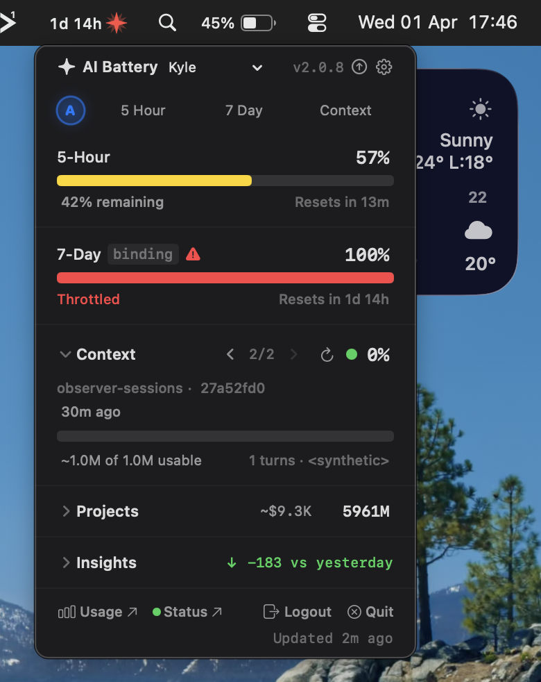
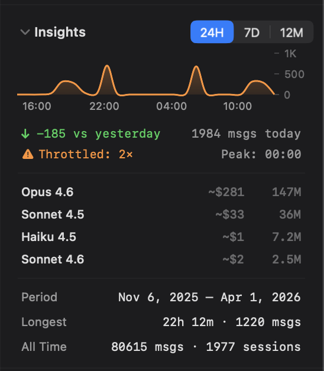
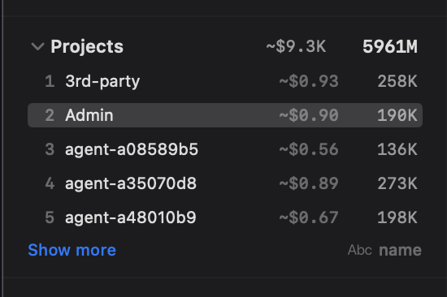

<div align="center">


# AI Battery

**Get the most out of your Claude subscription.**

[aibattery.dev](https://aibattery.dev)

Monitor rate limits, context health, and token usage — always visible in your macOS menu bar.

[](https://swift.org)
[](https://www.apple.com/macos/)
[](LICENSE)
[](https://github.com/KyleNesium/AIBattery/actions/workflows/ci.yml?query=branch%3Amain+event%3Apush)
[](https://github.com/KyleNesium/AIBattery/stargazers)
[](https://github.com/KyleNesium/AIBattery/releases)

<br/>



<p><strong>Live rate limits, context health, and usage trends without leaving the menu bar.</strong></p>

</div>

## 📦 Install

<table>
<tr>
<td width="30"></td>
<td><strong>Homebrew</strong> (recommended)</td>
</tr>
</table>

```bash
brew tap KyleNesium/tap
brew install --cask aibattery
```

<details>
<summary>⚡ <strong>Quick install</strong> — paste in Terminal</summary>

```bash
curl -sL https://github.com/KyleNesium/AIBattery/releases/latest/download/AIBattery.zip -o /tmp/AIBattery.zip && ditto -x -k /tmp/AIBattery.zip /Applications && xattr -cr /Applications/AIBattery.app && open /Applications/AIBattery.app
```

</details>

<details>
<summary>💿 <strong>DMG download</strong></summary>

Download from [Releases](https://github.com/KyleNesium/AIBattery/releases/latest):

1. Open `AIBattery.dmg` and drag **AI Battery** to **Applications**
2. Launch from Applications — macOS will block it on first run
3. Open **System Settings → Privacy & Security** → scroll down → click **Open Anyway**

> [!TIP]
> If macOS says the app is damaged, run `xattr -cr /Applications/AIBattery.app` then relaunch.

</details>

<details>
<summary>🛠 <strong>Build from source</strong></summary>

```bash
git clone https://github.com/KyleNesium/AIBattery.git && cd AIBattery
./scripts/build-app.sh
open .build/AIBattery.app
```

</details>

Requires **macOS 13+** and [Claude Code](https://docs.anthropic.com/en/docs/claude-code). See [aibattery.dev](https://aibattery.dev) for more info.

---

## 🔄 Update

AI Battery checks for updates once per day. When available, the header arrow turns **yellow** and a banner appears.

| Method | How |
|---|---|
| **In-app** (recommended) | Click **Install Update** — [Sparkle](https://sparkle-project.org/) downloads, verifies, replaces, and relaunches |
| **Homebrew** | `brew upgrade --cask aibattery` |
| **DMG** | Download from [Releases](https://github.com/KyleNesium/AIBattery/releases/latest), drag to Applications |

Settings and OAuth sessions carry over automatically. Updates are user-initiated only — nothing downloads in the background.

---

## 🔐 Authentication

OAuth 2.0 with PKCE — same protocol as Claude Code. Supports up to **3 accounts** (separate Claude orgs).

| Step | Action |
|:---:|---|
| **1** | Launch AI Battery — the auth screen appears on first run |
| **2** | Click **Sign In** → browser opens to Anthropic's sign-in |
| **3** | Sign in → copy the authorization code |
| **4** | Paste into AI Battery → done |

**Multiple accounts:** Use the header dropdown to switch accounts or add new ones (up to 3). Each account has its own rate limits, tokens, and identity.

<details>
<summary>🔑 <strong>Session details</strong></summary>

- Sessions auto-refresh with a 5-minute buffer to avoid clock-skew issues
- Temporary server errors retry automatically
- Refresh token stored in macOS Keychain per account (separate from Claude Code credentials); access token held in memory only
- Error messages are specific — expired codes, invalid codes, server errors, and network errors each get a clear description

</details>

<details>
<summary>🛡 <strong>Why does macOS block the app or ask about Keychain access?</strong></summary>

AI Battery isn't notarized — there's no Apple Developer license behind this project, so macOS treats it as unidentified. Two prompts may appear on first launch:

- **Gatekeeper block** — macOS prevents the app from opening. Fix: **System Settings → Privacy & Security → Open Anyway** (see [Install](#-install))
- **Keychain access** — the app stores its OAuth refresh token in macOS Keychain (one item per account), Apple's encrypted credential store. Click **Always Allow**. The prompt may reappear once after an in-app update because the new binary has a different ad-hoc signature.

The Gatekeeper prompt is one-time. The Keychain prompt appears once on first launch and once after each in-app update.

</details>

---

## 📐 Metrics

A minimal API fetch reads Claude Code account metadata for 5-hour and 7-day usage, with legacy header fallback when available. Local JSONL session logs provide token counts and context health — **never your message content**. Click the ✦ icon to open the dashboard.

The tab picker selects which metric drives the ✦ icon color:

| Mode | Tracks | Best for |
|---|---|---|
| ⏱ **5-Hour** | Burst rate limit | Knowing when you'll get throttled |
| 📅 **7-Day** | Sustained rate limit | Pacing usage across the week |
| 🧠 **Context** | Session context fullness | Knowing when to start fresh |
| **(A) Auto** | Highest urgency metric | Always seeing the most critical metric |

Selected metric moves to the top. The other two stay visible below.

> [!NOTE]
> The 5-hour and 7-day bars come from Anthropic API sliding-window headers. They may differ from Claude Code `/usage`, which uses different plan-usage semantics and reset timings.

**Auto mode**: click the **(A)** button next to the tabs. It glows blue when active and automatically selects whichever metric has the highest percentage — so the menu bar always shows your most critical limit. To switch back to manual, click any tab — auto mode disables and switches in one action.

<div align="center">

</div>

---

## 🧠 Context Health

Shows your **5 most recent sessions** with context health. Browse with `< 1/5 >` chevrons or swipe left/right. Stale sessions (idle > 30 min) show an amber "Idle" badge.

Each session displays: **project name** · **git branch** · **duration** · **last active time**.

Percentages are relative to the **usable window** — 80% of the model's raw context window. At 100%, Claude Code auto-compacts and quality drops. Keep at least 20-40% free for best results.

| Color | Range | Meaning |
|---|---|---|
| 🟢 Green | < 60% | Plenty of room |
| 🟠 Orange | 60–80% | Quality may degrade |
| 🔴 Red | > 80% | Start a fresh session |

<div align="center">

</div>

<details>
<summary>⚠️ <strong>Understanding context</strong></summary>

**Think of context as Claude's short-term memory.** Every message, file read, tool call, and response accumulates in a 200K-token window. Nothing is discarded between turns. When it fills up, Claude Code auto-compacts — summarizing the session into a few paragraphs and clearing the rest. That summary is lossy: file contents, specific instructions, and nuanced decisions get compressed. Claude keeps working, but from a recap instead of the real conversation.

**Long conversation (15+ turns)** — Nothing is discarded between turns. Your messages, Claude's responses, tool calls, and results all accumulate. After ~15 turns the window is full of old history that Claude still reads every turn — slowing responses, reducing quality, and burning through your token budget on stale context.

**High input:output ratio (20:1+)** — More tokens are going in (file reads, error logs, tool results) than coming out. For example, reading 5 large files dumps thousands of tokens into context that Claude may only reference once. That data stays in the window for the rest of the session, consuming tokens on every subsequent turn and leaving less room for useful work.

**Zero-output session** — Session has multiple turns but no output tokens. May indicate an error loop or stalled conversation.

**Rapid token consumption** — Very short session with high token usage. Large files or long pastes may be filling the context window quickly.

</details>

> [!TIP]
> **When you hit orange or red:**
> 1. Run `/compact` to save a summary to project memory
> 2. Keep key decisions in `CLAUDE.md` — loaded automatically every session
> 3. Start a new terminal in the same directory and pick up where you left off

---

## ⚙️ Settings

Click ⚙️ in the header to configure:

| Setting | What it does |
|---|---|
| ➕ **Add Account** | Connect another Claude account (up to 3) |
| ✏️ **Account names** | Custom label per account (shown in picker + menu bar) |
| 🔁 **Auto mode** | Always show the highest metric (pulsing blue button on metric toggle) |
| 🔄 **Refresh** | Poll interval: 10–60s · ~3 tokens per refresh |
| ⏳ **Idle** | Hide sessions idle longer than cutoff from context health: 30m–8h or Never |
| 🎨 **Colorblind** | Blue/cyan/amber/purple palette |
| 🪟 **All accounts in menu bar** | Show every connected account's percent in the menu bar (e.g. `42% \| 23%`). Star color and countdown reflect the worst account. |
| 💲 **Cost** | Always visible — API-equivalent cost in Insights and Projects |
| 🔔 **Alerts** | Notify on status page outages (all components) |
| ⚡ **Rate Limit** | Notify when usage crosses threshold (50–95%) |
| 🚀 **Launch at Login** | Start automatically when you log in |

<div align="center">

</div>

> [!TIP]
> Click any stat value (percentages, token counts, costs) to copy it to the clipboard.

---

## 📉 Activity & Insights

Interactive charts across three time windows:

| Mode | Window | Shows |
|---|---|---|
| **24H** | Trailing 24 hours | Hourly activity, vs-yesterday trend, peak hour |
| **7D** | Rolling 7 days | Daily activity, weekly trend, busiest day |
| **12M** | Rolling 12 months | Monthly activity, month-over-month trend, busiest month |

Below the chart: API-equivalent cost per model, throttle count, and cumulative stats (All Time messages/sessions, Longest session, Period date range).

<div align="center">

</div>

---

## 💰 API Cost Equivalent

Dollar amounts show what your usage **would have cost on Anthropic's pay-per-token API** — not your actual bill. Pro, Max, and Teams subscribers pay a flat monthly fee. When the API-equivalent exceeds your monthly fee, your subscription is saving you money. The bigger the gap, the better the deal. Pricing uses Anthropic's published per-million-token rates.

<div align="center">

</div>

<details>
<summary><strong>How token tracking works</strong></summary>

AI Battery reads Claude Code's session logs (`~/.claude/projects/`) and stats cache (`~/.claude/stats-cache.json`) — it never writes to Claude Code's files or reads message content, only token counts.

To prevent totals from dropping when Claude Code rebuilds its cache, AI Battery maintains a **persistent ledger** (`~/Library/Application Support/AIBattery/token-ledger.json`) that keeps the high-water mark for each model. Token totals never decrease, even across cache rebuilds.

</details>

<details>
<summary><strong>How project tracking works</strong></summary>

The **Projects** section groups token usage by the directory you ran Claude Code in. AI Battery scans all `.jsonl` session logs under `~/.claude/projects/`, deduplicates by message ID, groups by working directory, and computes API-equivalent cost per project.

Project data appears after you've run at least one Claude Code session.

</details>

---

## 🔧 Troubleshooting & FAQ

<details open>
<summary><strong>App appears in the menu bar then disappears</strong></summary>

**On first launch:** macOS Gatekeeper may silently kill the app because it's not notarized.

```bash
xattr -cr /Applications/AIBattery.app
```

Then relaunch. This removes the quarantine flag that macOS adds to downloaded apps.

**After working for a while:** If the icon vanishes after the app has been running, update to the latest version — v2.0.3+ fixed concurrency issues that could cause intermittent crashes during background data refresh and sleep/wake cycles.

**If it still happens:**

1. Open **Console.app** → filter for "AIBattery" → look for crash logs
2. Check your macOS version — macOS 13.0–13.2 had `MenuBarExtra` bugs fixed in 13.3+
3. [Open an issue](https://github.com/KyleNesium/AIBattery/issues) with the crash log

</details>

<details>
<summary><strong>macOS says "AI Battery is damaged and can't be opened"</strong></summary>

This is the quarantine flag. Run:

```bash
xattr -cr /Applications/AIBattery.app
```

Then relaunch.

</details>

<details>
<summary><strong>Keychain access dialog keeps appearing</strong></summary>

Click **Always Allow** when prompted. AI Battery stores its OAuth refresh token in macOS Keychain (one item per account). After a Sparkle in-app update, a single Keychain prompt may appear because the new binary has a different ad-hoc signature. This is a one-time prompt per update.

</details>

<details>
<summary><strong>Only rate limits show — tokens, models, and activity are all empty?</strong></summary>

Token usage, context health, and activity stats come from Claude Code's local session logs (`~/.claude/`). These populate after you've used Claude Code for a bit. To kickstart it:

1. Run a few Claude Code sessions from the terminal
2. Run `/stats` inside Claude Code — this generates the stats cache
3. AI Battery refreshes automatically every polling cycle

Claude Code usage windows (5-hour / 7-day) are fetched from Anthropic account metadata. If Anthropic changes that response shape, AI Battery falls back to cached values and may show a warning until fresh usage data is available again.

</details>

<details>
<summary><strong>Green ✦ at 0%?</strong></summary>

Credits just reset, or no usage yet — this is normal.

</details>

<details>
<summary><strong>What's "binding"?</strong></summary>

Whichever rate limit window is currently the active constraint. The binding window determines the percentage shown in the menu bar.

</details>

<details>
<summary><strong>What's ⚠️ "throttled"?</strong></summary>

Anthropic is actively limiting your requests. Wait for the reset timer.

</details>

<details>
<summary><strong>Why can AI Battery differ from Claude Code `/usage`?</strong></summary>

AI Battery primarily shows Claude Code 5-hour and 7-day usage from Claude Code account metadata. It may fall back to legacy Anthropic headers or cached values when those windows are temporarily unavailable, so percentages and reset times can still differ from Claude Code `/usage` during API transitions or stale-data fallback.

</details>

---

## 🔒 Privacy & Security

| | |
|---|---|
| 📂 **Local only** | Reads JSONL for token counts — **never your message content** |
| 🔑 **Keychain** | OAuth refresh token stored in macOS Keychain (`kSecAttrAccessibleWhenUnlockedThisDeviceOnly`) — access token is memory-only, never written to disk |
| 🌐 **Network** | `api.anthropic.com` (rate limits) · `console.anthropic.com` (OAuth) · `status.claude.com` (status) · `api.github.com` (update check, once/24h) · `kylenesium.github.io` (Sparkle appcast) |
| 🚫 **No tracking** | No analytics. No telemetry. No data collection. Period. |
| 🔍 **Open source** | Every line is auditable — [review the code](https://github.com/KyleNesium/AIBattery) |
| ✅ **Release checks** | Each release runs [`verify-release.sh`](scripts/verify-release.sh) — validates codesign, Sparkle signatures, version consistency, and bundle integrity before publish |

---

## 🏗 Architecture

```
AIBattery/
  Models/       — Data structs (UsageSnapshot, RateLimitUsage, TokenHealthStatus, ...)
  Services/     — OAuthManager, RateLimitFetcher, SessionLogReader, TokenHealthMonitor, ...
  ViewModels/   — Single UsageViewModel (@MainActor, ObservableObject)
  Views/        — SwiftUI views (popover sections, menu bar label, auth screen)
  Utilities/    — TokenFormatter, ModelNameMapper, ThemeColors, AppLogger
```

**One dependency** — [Sparkle 2](https://sparkle-project.org/) for auto-update. Everything else is Apple frameworks (SwiftUI, Charts, Security, Foundation, AppKit).

<details>
<summary>📋 <strong>Detailed specs</strong></summary>

| File | Covers |
|---|---|
| [`ARCHITECTURE.md`](spec/ARCHITECTURE.md) | Data flow, project tree, build config, network & file access |
| [`DATA_LAYER.md`](spec/DATA_LAYER.md) | Every model, service, and algorithm |
| [`UI_SPEC.md`](spec/UI_SPEC.md) | View hierarchy, layout rules, section specs |
| [`CONSTANTS.md`](spec/CONSTANTS.md) | Every hardcoded value — thresholds, URLs, pricing, sizes |

</details>

---

## ♿ Accessibility

- **VoiceOver** — all interactive elements include accessibility labels and hints; collapsible sections announce state; copy actions announce confirmation
- **Keyboard navigation** — fully navigable without a mouse
- **Colorblind mode** — Settings → Display → Colorblind switches to a blue/cyan/amber/purple palette
- **First-launch tutorial** — 3-step walkthrough on first use

---

## 🗑 Uninstall

**Homebrew:**

```bash
brew uninstall --cask aibattery
```

<details>
<summary>🧹 <strong>Manual uninstall</strong></summary>

1. Right-click **AI Battery** in the menu bar → **Quit**
2. Open **Applications** in Finder → drag **AI Battery** to the Trash

To also remove stored settings:

```bash
security delete-generic-password -s "AIBattery" 2>/dev/null   # OAuth tokens (all accounts)
defaults delete com.KyleNesium.AIBattery 2>/dev/null           # Preferences
```

AI Battery doesn't write any other files. Your Claude Code data (`~/.claude/`) is untouched.

</details>

---

## 🤝 Contributing & Support

Contributions welcome — read the [contributing guide](CONTRIBUTING.md) first. See [CHANGELOG.md](CHANGELOG.md) for version history.

AI Battery is **free and open source** — always will be. If it helps you get more out of Claude, consider [sponsoring the project](https://github.com/sponsors/KyleNesium).

[](https://github.com/sponsors/KyleNesium)

---

## 🧪 Test Coverage

**1027 tests** across 67 test files.

| Area | Tests | What's covered |
|------|-------|----------------|
| Models | 269 | Token summaries, rate limit parsing (unified + standard + client data edge cases, timestamp rejection, 100%-without-status is not throttled), health status, metric modes, API profiles, usage snapshots (incl. escalation ladder, hysteresis), model pricing, Claude system status indicators, standard rate limits, local usage estimate calibration policy (uncalibrated-only seeding, 20–80% calibration band), expired-window + unbounded-throttle clearing on cache restore, rollover-artifact suppression (near-full reading on a just-started window) |
| Services | 338 | Token ledger (incl. high-water merge, pending→resolved account migration, orphan pruning with empty-set guard), version checker, Sparkle updates, notifications, health monitor (incl. zero-window safety), status checker (incl. concurrency: detached-task callability + MainActor-non-blocking), session log reader (incl. NSLock/pendingInvalidation concurrency, incremental scanning, entry eviction), account store, stats cache, usage aggregator (incl. side-effects, integration tests, 7d rolling-window boundary), rate limit fetcher (incl. quota-vs-upstream 429 disambiguation, consecutive auth-failure counter, actor-isolation guarantees on nonisolated helpers, expired-window clearing on cachedOrEmpty, 15 contract tests pinning both OAuth interpreters' status-code / payload / 429-throttle behavior), OAuth (incl. Sendable conformance on TokenResult/AuthError, transient-vs-auth-error classifier, concurrent-refresh deadlock-freedom), adaptive polling |
| Views | 135 | Activity chart data transforms (5H/7D/12M token-based), chart display state (loading vs empty vs data — no cold-start "No activity" flash), trend computation (token-based, incl. meaningful-previous threshold + display cap to prevent noise spikes like "+47999% vs yesterday"), session info formatting (incl. injectable-now for deterministic Today/Yesterday across midnight rollover), GaugeBar clamping, deferred rendering, status bar toggle/countdown, insights view formatting, metric toggle ordering, multi-account menu bar text rendering (formatting, ordering, missing slots, worst-percent, genuine-throttle-only exhaustion — 100% without status is at-capacity, not throttled — binding-window code prefix on throttled countdown, metric mode fallback), multi-account display resolver (end-to-end: gate + builder + countdown composition + single-account fallback, all v2.2.0-regression scenarios pinned) |
| ViewModels | 47 | Refresh interval clamping, error messages (incl. standard limits fallback), adaptive polling, throttle tracking, idle threshold constants, TTL-based stale rate limit expiry (incl. expired-window clearing on stale fallback), effective value generic guard, auth-error reconnect prompt |
| Utilities | 207 | Token/duration formatting (incl. billion-scale), model name mapping, theme colors (incl. isDarkMenuBar gold override), secure networking, menu bar icon animations, throttle tracker (genuine-throttle-only event recording + on/off transition), typography, spacing, idle suspension policy, retry policy (exponential backoff + jitter + Retry-After parsing, parity tests pinning historical OAuth/StatusCheck/FileWatch formulas) |

---

## 📄 License

[MIT](LICENSE)
